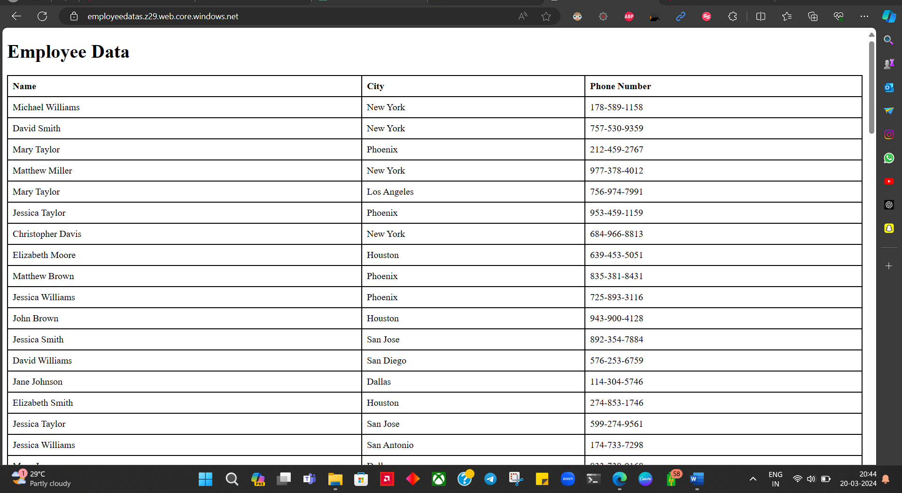

# Azure Storage Setup for Static Website Deployment

This guide walks you through the process of configuring Azure Storage for hosting a static website.

## Overview

This repository contains step-by-step instructions for setting up Azure Storage to host a static website. By following these instructions, you'll be able to create a storage account, enable the static website feature, upload your website files, and configure the necessary settings for deployment.

## Table of Contents

1. [Prerequisites](#prerequisites)
2. [Setup Instructions](#setup-instructions)
3. [Website Preview](#Website-Preview)
4. [Usage](#usage)
5. [Additional Documentation](#additional-documentation)
6. [Contributing](#contributing)

## Prerequisites

Before you begin, ensure you have the following:

- Azure account with sufficient permissions to create storage accounts.
- Access to the Azure web portal.

## Setup Instructions

1. **Login to Azure Portal**:
   - Sign in to your Azure account using the Azure web portal.

2. **Navigate to Storage Accounts**:
   - Go to the Azure Storage Accounts service.

3. **Create a New Storage Account**:
   - Click "Storage accounts".
   - Click "Add" to create a new storage account.
   - Fill in the required details such as account name, resource group, location, etc.
   - Choose the "StorageV2" account kind and "General Purpose V2" performance.
   - Enable the "Static website" option under the "Settings" tab and specify the index and error documents.
   - Click "Review + create" and then "Create" to create the storage account.

## Usage

Follow the provided instructions to host your static webpage on Azure using storage service. Share the generated URL with others to access your webpage.

## Website Preview

## Additional Documentation

For more detailed instructions and additional resources, please refer to the [documentation folder](Documentation/) in this repository. The documentation includes PDF files with detailed guides, best practices, and exercises for practicing.

## Contributing

Contributions to this repository are welcome! If you find issues or have suggestions for improvements, please open an issue or submit a pull request.
